# OpenGeoDrone — Parametric RC VTOL Generator

> A fully parametric VTOL designed in OpenSCAD, built for **vase mode 3D printing**. The project generates a complete aircraft: wings with internal structure, a Bézier-profiled fuselage, motor arms, winglets, ailerons, and a center body.

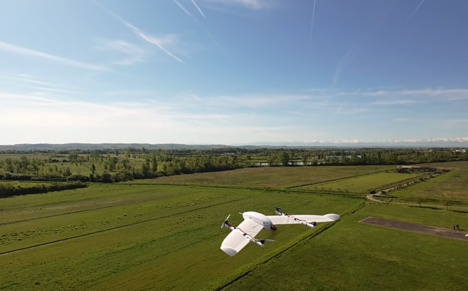

---

## Financial Support

The development of the OpenGeoDrone was funded by the French National Research Agency (ANR, Agence Nationale de la Recherche) and the German Research Foundation (DFG, Deutsche Forschungsgemeinschaft) within the framework of the Franco-German research project FlyHigh (grant no. [grant number ENAC] and GR 5407/2-1)

 


---

## Table of Contents

- [Overview](#overview)
- [Repository Structure](#repository-structure)
- [Quick Start](#quick-start)
- [How the Wings Are Built — The Vase Mode Method](#how-the-wings-are-built--the-vase-mode-method)
- [How the Fuselage Is Built — C1 Quintic Bézier](#how-the-fuselage-is-built--c1-quintic-bézier)
- [Parts to Print](#parts-to-print)
- [Key Parameters Reference](#key-parameters-reference)
- [Slicer Setup](#slicer-setup)
- [Performance Tips](#performance-tips)
- [Credits and Prior Work](#credits-and-prior-work)
- [License](#license)

---

## Overview

OpenGeoDrone is a VTOL UAV designed entirely in OpenSCAD. The goal is to produce aerodynamically efficient, lightweight, and printable parts using the **spiral vase mode** of FDM slicers (also called "spiralize outer contour"). This mode prints the outer skin as a single continuous spiral — no retractions, no seams, very low weight.

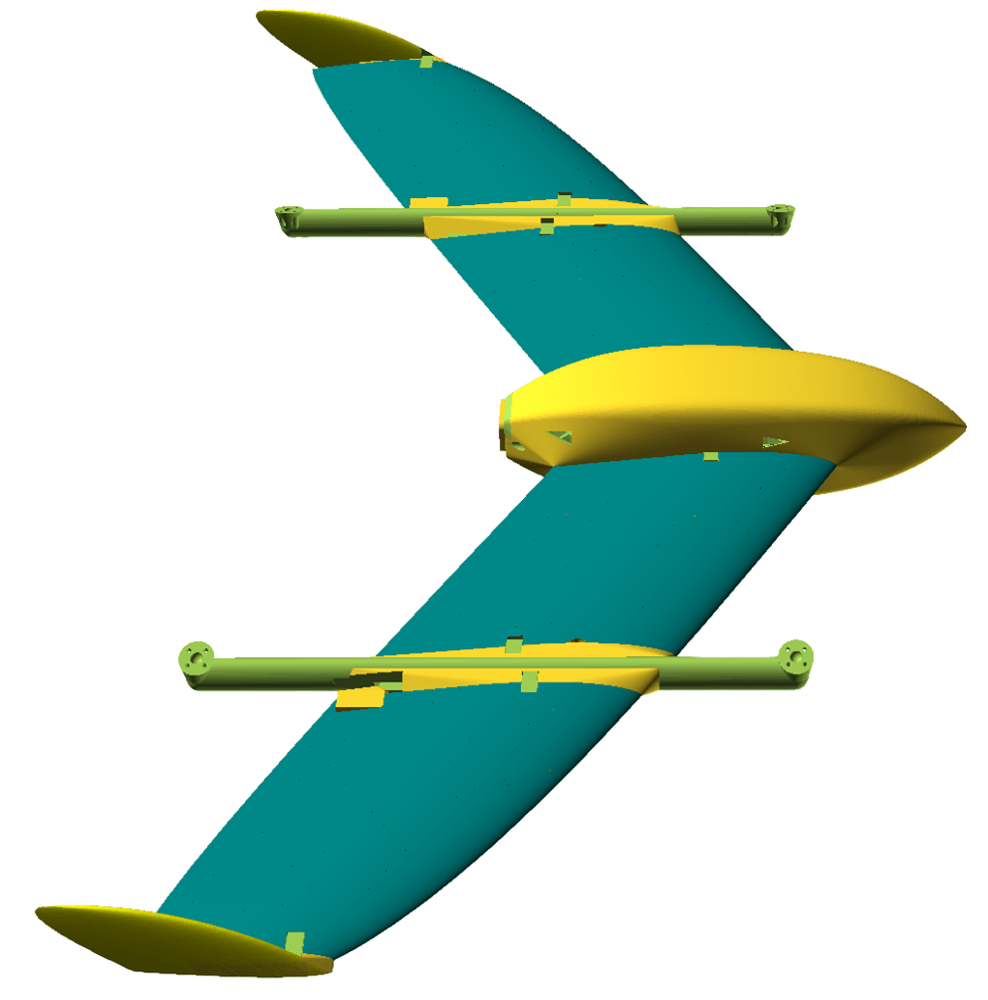

The aircraft is parametric end-to-end: wing span, chord, sweep, airfoil, motor position, spar count, aileron geometry, fuselage shape, and more are all driven by variables in a single file (`OpenGeoDrone.scad`). Changing one number regenerates every dependent part automatically.

**VTOL, Vertical Take-Off and Landing :**

The aircraft takes off and lands using its four hovering motors. It flies like a plane thanks to a pusher motor and two elevons.

 

**Default aircraft specs (all configurable):**

- **Half-wingspan**: 510 mm (total ~1200 mm + center body)
- **Root chord**: 210 mm
- **Airfoil: MH61** (cambered, suitable for slow stable RC flight)
- **3 carbon fiber spars** per half-wing
- **Pusher/puller motor** on a tilted arm
- **2 Elevons** for roll control
- **Center part dimensions** 275mmx90mm
- **Mass**  1.066kg
- **Payload mass**  1.15kg with 60% throttle in hovering
- **Hoovering** 34% throttle
- **Min plane flying speed**  14m/s
- **Wings easy to remove** no cables


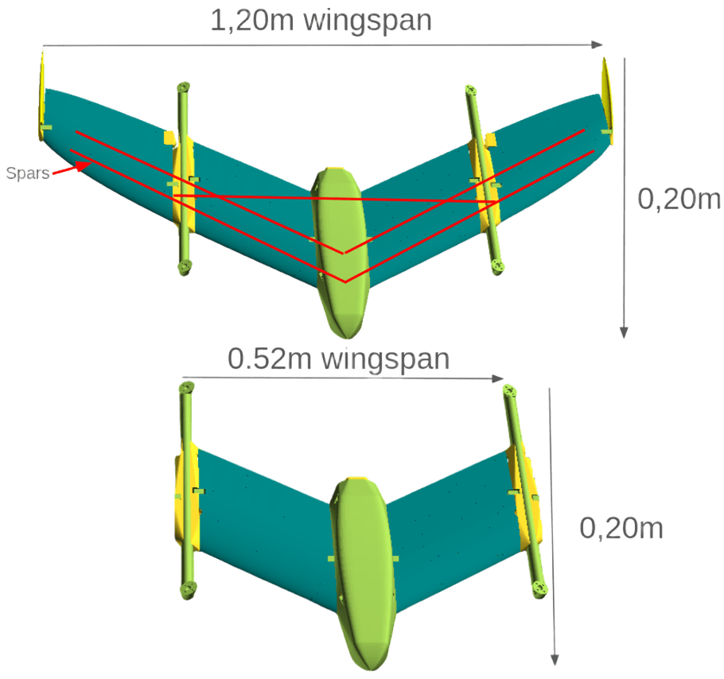

**Differents parts:**

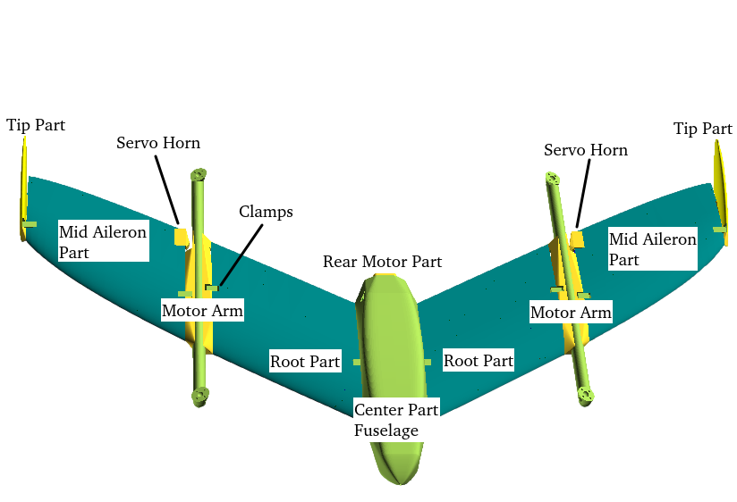

---

## Repository Structure

```
Vase_wing_openscad/
│
├── OpenGeoDrone.scad               # Main entry point — all parameters and top-level assembly
│
├── lib/
│   ├── Wing-Creator.scad      # Wing shell geometry (airfoil lofting, sweep, washout)
│   ├── Grid-Structure.scad    # Internal rib and spar grid structure
│   ├── Grid-Void-Creator.scad # Clearance voids ensuring vase mode continuity
│   ├── Rib-Void-Creator.scad  # Optional weight-reduction holes in ribs
│   ├── Spar-Hole.scad         # Carbon spar tube holes and retaining rings
│   ├── Aileron-Creator.scad   # Aileron geometry, pin holes, command pin voids
│   ├── Motor-arm.scad         # Motor arm tube, tilt, attachment to wing
│   ├── Winglet-Creator.scad   # Winglet geometry and attachment interface
│   ├── Center-part.scad       # Center body / fuselage assembly
│   ├── Servo-Hole.scad        # Servo pocket geometry
│   ├── Helpers.scad           # Utility functions (chord interpolation, spline, etc.)
│   ├── Tools.scad             # General geometry helpers
│   └── openscad-airfoil/      # Airfoil coordinate libraries (MH45, NACA0008, etc.)
│
├── bambulab_preset/           # Ready-to-import slicer presets for Bambu Lab printers
├── git-images/                # Screenshots of rendered wings for this README
├── stl_generator.sh           # Bash script to batch-export all STL files via OpenSCAD CLI
└── README.md                  # This file
```

**The single file to open is `OpenGeoDrone.scad`.** All parameters live at the top of that file. The `lib/` modules are included automatically — you never need to edit them directly.

---

## Quick Start

### 1. Install OpenSCAD with the Manifold engine

Standard OpenSCAD is very slow on this model. Use the **development snapshot** with the Manifold geometry engine, which is approximately 100× faster:

1. Download a development snapshot: [openscad.org/downloads.html#snapshots](https://openscad.org/downloads.html#snapshots)
2. Open **Edit → Preferences → Features**
3. Enable the **Manifold** checkbox

### 2. Open the project

```
File → Open → OpenGeoDrone.scad
```

### 3. Select the part to render

At the top of `OpenGeoDrone.scad`, set exactly one part flag to `true`:

```openscad
// --- Choose the part to export ---
Root_part                 = true;   // Wing root section (fuselage side)
Mid_Aileron_part          = false;  // Mid section + aileron as one piece
Tip_part                  = false;  // Wing tip section (+ winglet if enabled)
Motor_arm_full            = false;  // Motor arm (front + back together)
Motor_arm_front           = false;  // Front half of motor arm only
Motor_arm_back            = false;  // Rear half of motor arm only
Servo_horn                = false;  // Servo horn

Center_part               = false;  // Center body / fuselage
Rear_motor_part           = false;  //Part for Rear motor attach
Clamp_fixation_big        = false;  // Clamp to fix parts together (ie wings to center_part or motor_arm)
Clamp_fixation_small      = false;  // Clamp to fix parts together (ie wing_tips to center_part or motor_arm)
Fuselage_front_part       = false; // Fuselage
Fuselage_bottom_back_part = false; // Fuselage
Fuselage_upper_part       = false; // Fuselage
Full_fuselage             = false; // Fuselage parts all together

Full_system        = false;  // Full assembly preview (not for printing)

// --- Choose the side ---
Left_side  = true;   // Generate left wing half
Right_side = false;  // Generate right wing half (mirrored)
```

### 4. Render and export

Press **F6** to render, then **File → Export → Export as STL**.

To export as STL all parts at once, use the batch script:

```bash
./stl_generator.sh
```

Parts will be exported in folder **stl_output**


---

## How the Wings Are Built — The Vase Mode Method

### What is vase mode?

Vase mode (also called "spiralize outer contour") is a slicer setting that prints only the outer wall as a single continuous upward spiral — no infill, no top/bottom layers, no retractions. For a wing this is ideal: the airfoil skin becomes a single-layer seamless tube that is light, smooth, and aerodynamically clean.

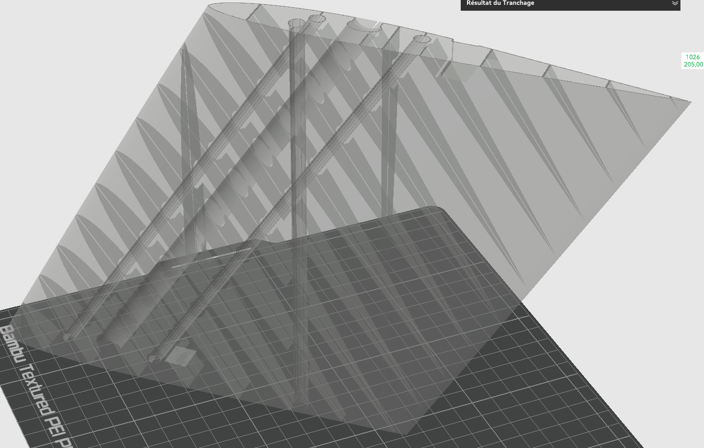

The geometry must be designed specifically for this mode. At every layer height, the cross-section of the model must form a **single closed contour** — if the slicer sees multiple disconnected loops, it cannot maintain the spiral and the print fails. Every design decision in this project (grid voids, spar hole placement, aileron connection geometry) exists to satisfy this constraint.

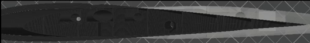


### Step 1 — Airfoil cross-sections

The wing shape starts with a 2D airfoil polygon. OpenGeoDrone uses profiles from the [openscad-airfoil](https://github.com/guillaumef/openscad-airfoil) library, which stores airfoil coordinates as OpenSCAD path arrays. These were pre-processed from UIUC `.dat` files using AeroSandbox to increase point density, resulting in smoother printed curves.

The default airfoil is **MH61**, a cambered profile well-suited for slow stable RC flight. The winglet uses **NACA0008**, a symmetric thin profile. Up to three different airfoils can be blended along the span (root, mid, tip) using `slice_transitions`.

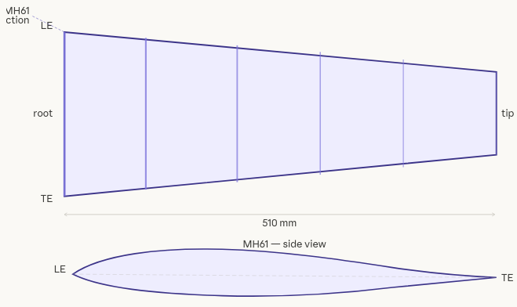


### Step 2 — Wing shell lofting

The wing outer skin is generated by `CreateWing()` in `Wing-Creator.scad`. The airfoil cross-section is placed and transformed at `wing_sections` spanwise stations (default: 50). At each station `z`, the section is:

- **Scaled** to the local chord length, following either a trapezoidal or elliptic planform (`wing_mode` parameter)
- **Swept** in X by a user-defined spline (`lead_edge_sweep` parameter) — this shifts the leading edge rearward as span increases, giving the wing its arrow shape
- **Curved** in Y by an optional spline (`lead_edge_curve_y`) — used for dihedral
- **Washed out** by rotating the section about a pivot point (`washout_pivot_perc` parameter) to progressively reduce angle of attack toward the tip, which improves stall behavior

The elliptic chord distribution uses a super-ellipse formula:

```
chord(z) = root_chord × (1 − (z / span)^p)^(1/p)
```

where `p = elliptic_param`. 

- A value of 2 gives a true ellipse 
- Values > 2 give a squarer tip 
- Values < 2 give a sharper tip

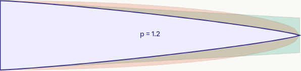

Each station is a near-zero-thickness extruded polygon. OpenSCAD's `hull()` operation connects consecutive stations into a smooth lofted surface — the wing outer skin.

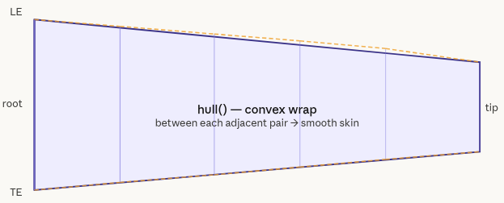


### Step 3 — Internal grid structure

The wing skin alone is too flexible. An internal rib-and-spar grid is built by `Grid-Structure.scad` and subtracted from the wing volume, creating a periodic internal skeleton visible through the skin after printing.

Two grid modes are available:

**Mode 1 — Diamond grid:** A diagonal lattice scaled by `grid_size_factor`. Lightweight and uniform, but without defined spar paths.

**Mode 2 — Spar + cross-rib grid (default):** Longitudinal spar walls at the same chord percentages as the carbon tubes, connected by `rib_num` transverse ribs. This is a structurally coherent option — the grid walls and the tube channels form a unified load path.

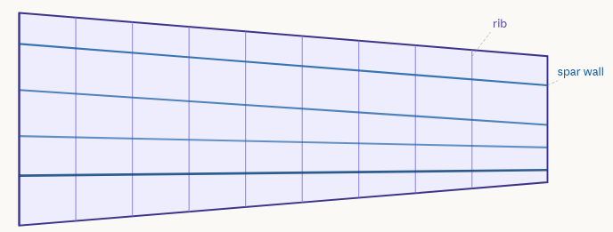

After the grid is built, `CreateGridVoid()` cuts narrow channels along every grid wall. **This is the key to vase mode compatibility**: the channels reduce each internal wall to a thin fin rather than a solid block, ensuring the slicer always sees a single outermost contour at every layer.

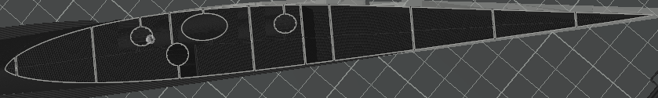

### Step 4 — Carbon spar holes

Three carbon fiber tube channels are cut through the wing by `Spar-Hole.scad`:

| Spar | Position from leading edge | Tube diameter |
|------|---------------------------|---------------|
| Spar 1 | 15% of chord | 5.5 mm |
| Spar 2 | 37% of chord | 5.5 mm |
| Spar 3 | 75% of chord | 6.5 mm |

Spar 1 and 2 holes are angled to follow the leading edge sweep, so the carbon tube runs geometrically parallel to the wing planform. Spar 3 is perpendicular to the root face and bigger diameter to increase the structure rigidity and create a block mechanism with a triangle system.

Around each hole, a ring of 12 small retaining circles (`spar_circle_holder = 0.25 mm`) creates a snap-fit friction interface that holds the tube in place after insertion without glue.

The same holes continue into the center body to connect both wing halves through the fuselage.

OpenSCAD prints the required tube lengths to the console at render time:

```
[SPAR] Spar 1 at 15% from LE is XXX mm length.
[SPAR] Spar 2 at 37% from LE is XXX mm length.
[SPAR] Spar 3 at 75% from LE is XXX mm length.
```

**Cut your carbon tubes to these exact lengths before assembly.**

### Step 5 — Elevons

Elevons are sticked to the mid part :
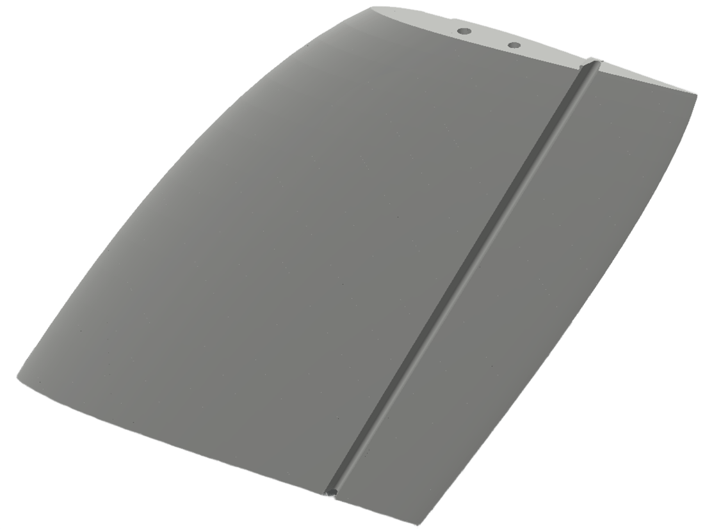

The connection between the mid part and the aileron is performed by a thin layer and tht actuation is done by the servo horn part connected to your servo:

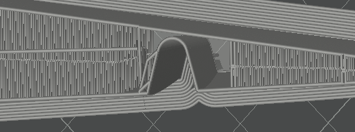

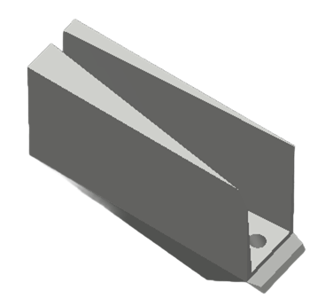


### Step 6 — Winglet

The winglet is a small upswept surface at the wingtip, generated by the same lofting method as the main wing but using the NACA0008 symmetric airfoil and a higher sweep angle. It connects to the tip section via two embedded carbon rods that slot into matching voids and a small clamp :

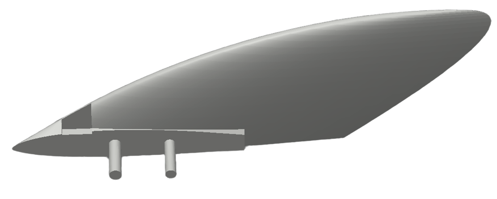

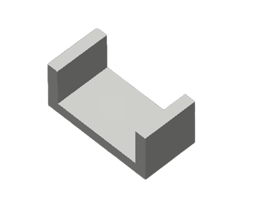

---

## How the Fuselage Is Built — C1 Quintic Bézier

The fuselage / center body profile is defined by a **quintic Bézier curve** (degree 5, 6 control points) that describes the body radius along the longitudinal axis. This gives a smooth, aerodynamic shape with guaranteed C1 continuity at both endpoints — the tangent is well-defined at the nose and tail, preventing any abrupt transitions.

### Longitudinal profile

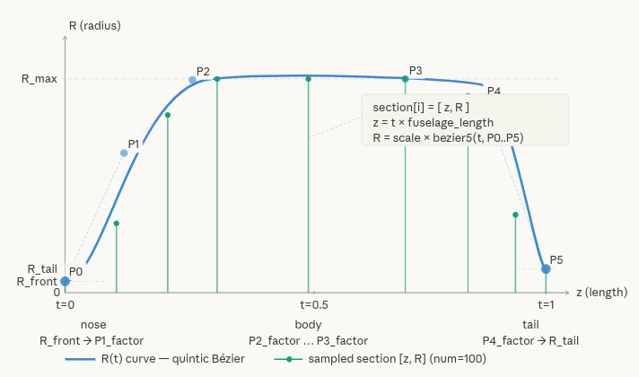

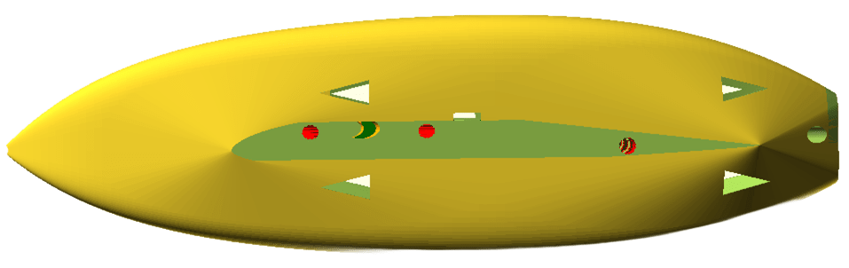

The six control points are derived from three base radii and five shape factors:

| Point | Value | Role |
|-------|-------|------|
| P0 | `R_front` | Nose radius |
| P1 | `R_front + P1_factor × (R_max − R_front)` | Nose tangent — controls C1 smoothness at nose |
| P2 | `R_front + P2_factor × (R_max − R_front)` | Controls widening speed |
| P3 | `R_tail + P3_factor × (R_max − R_tail)` | Controls how long the body stays wide |
| P4 | `R_tail + P4_factor × (R_max − R_tail)` | Tail tangent — controls C1 smoothness at tail |
| P5 | `R_tail + P5_factor × (R_max − R_tail)` | Tail radius |

The curve is numerically normalized so that `max(R(t))` is equal to center_part width, regardless of what factor values are chosen.

### Cross-section — asymmetric super-ellipse

Each longitudinal station generates a 2D polygon using an **asymmetric super-ellipse**:

```
ca = cos(a),  sa = sin(a)

x = rx · sign(ca) · |ca|^(2/nx)
y = ry · sign(sa) · |sa|^(2/ny)
```

The vertical radius `ry` uses two independent scaling factors:

- **Upper half** (`sa ≥ 0`): `ry = rx × fuselage_scale_y_top`
- **Lower half** (`sa < 0`): `ry = rx × fuselage_scale_y_bottom`

This makes the fuselage asymmetric vertically — for example, flatter on the bottom for a landing skid while remaining more rounded on top. Both halves meet seamlessly at `y = 0`.

The exponents in `fuselage_ellipse_param = [nx, ny]` control the cross-section shape:
- `n = 2` → standard ellipse
- `n = 4` → rounded rectangle
- `n → ∞` → rectangle

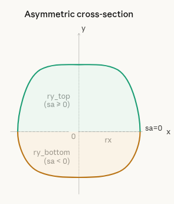

### Assembly

`fuselage_sections()` produces an array of 101 pairs `[z, rx]` by evaluating the Bézier curve at `num = 100` equally spaced parameter values. Each pair becomes one frame — a thin 2D polygon at position `z` along the body axis.

The fuselage is then assembled in by chaining `hull()` between every pair of consecutive frames, producing 100 smooth segments that form a seamless body skin.

Finally, the module wraps the fuselage in a global `hull()` together with the inboard wing root cross-sections, creating a smooth aerodynamic fairing between fuselage and wing with no sharp steps or manual fillets.

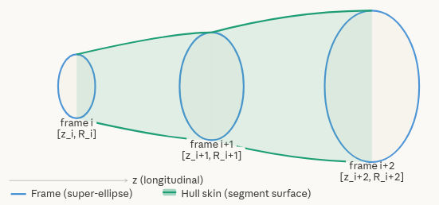

---

## Parts to Print

### Wings

- **Left_Root_part**
- **Right_Root_part**
- **Left_Mid_Aileron_part**
- **Right_Mid_Aileron_part**

### Side parts

- **Left_Motor_arm_back**
- **Left_Motor_arm_front**
- **Right_Motor_arm_back**
- **Right_Motor_arm_front**
- **Left_Tip_part**
- **Right_Tip_part**
- **Left_Servo_horn**
- **Right_Servo_horn**

### Clamps parts

- 6 x **Clamp_fixation_big**
- 2 x **Clamp_fixation_small**

### Center body

- **Center_part**
- **Fuselage_bottom_back_part**
- **Fuselage_front_part**
- **Fuselage_upper_part**
- **Rear_motor_part**

### Hardware (not printed)

- Carbon fiber tube ⌀5.5 mm
- Carbon fiber tube ⌀6.5 mm
- Flight controller (e.g. Tawaki)
- 2 Servo
- RC
- Pitot tube
- GPS module and Modem to Ground station if needed
- 4 Motors for hoovering (F40) 
- 1 ESC 4 to 1 
- 2 Propellers 7x4 and 2 reverse Propellers 7x4  
- 1 Motor for pusher (low kV < 1200) 
- 1 ESC for pusher 
- 1 Propeller 9x6


### Assembly order

1. **TODO**

---

## Key Parameters Reference

### Wing geometry

| Parameter | Default | Description |
|-----------|---------|-------------|
| `wing_mm` | 500 | Half-wingspan in mm |
| `wing_root_chord_mm` | 180 | Root chord length in mm |
| `wing_tip_chord_mm` | 110 | Tip chord (trapezoidal mode only) |
| `wing_mode` | 2 | `1` = trapezoidal, `2` = elliptic |
| `elliptic_param` | 3.5 | Elliptic exponent (2 = true ellipse, >2 = squarer tip) |
| `wing_sections` | 50 | Spanwise resolution — higher = smoother, slower |
| `wing_root_mm` | 215 | Spanwise length of root section |
| `wing_mid_mm` | 245 | Spanwise length of mid section |
| `AC_CG_margin` | 10% | CG target margin aft of aerodynamic center |


### Fuselage

| Parameter | Default | Description |
|-----------|---------|-------------|
| `center_width` | 80 mm | Maximum fuselage width |
| `center_length` | 275 mm | Fuselage total length |
| `R_front` | 1 mm | Nose radius |
| `R_max` | `center_width/2` | Maximum body radius (normalized exactly) |
| `R_tail` | 5 mm | Tail exit radius |
| `fuselage_scale_y_top` | 1.2 | Upper half vertical scaling ratio |
| `fuselage_scale_y_bottom` | 1 | Lower half vertical scaling ratio |
| `fuselage_ellipse_param` | `[7, 4.8]` | Cross-section super-ellipse exponents `[nx, ny]` |
| `num` | 100 | Number of longitudinal Bézier frames |


### Carbon spars

| Parameter | Default | Description |
|-----------|---------|-------------|
| `spar_hole_perc` | 15% | Spar 1 chord position from leading edge |
| `spar_hole_perc_2` | 37% | Spar 2 chord position |
| `spar_hole_perc_3` | 75% | Spar 3 chord position |
| `spar_hole_size` | 5.6 mm | Spar 1 & 2 tube outer diameter |
| `spar_hole_size_3` | 6.65 mm | Spar 3 tube outer diameter |
| `spar_circles_nb` | 12 | Retaining ring segment count |
| `spar_circle_holder` | 0.25 mm | Retaining ring interference radius |

### Motor arm

| Parameter | Default | Description |
|-----------|---------|-------------|
| `motor_arm_length_front` | 170 mm | Front tube length |
| `motor_arm_length_back` | 210 mm | Rear tube length |
| `motor_arm_tilt_angle` | 20° | Motor tilt angle |
| `motor_arm_height` | 19 mm | Arm cross-section height |
| `ellipse_maj_ax` | 9 mm | Arm tube major axis radius |
| `ellipse_min_ax` | 13 mm | Arm tube minor axis radius |

### Quality and rendering

| Parameter | Default | Description |
|-----------|---------|-------------|
| `draft_quality` | `false` | Set to `true` for fast coarse preview |
| `$fa` | 5° | Maximum angle between mesh segments |
| `$fs` | 1 mm | Maximum segment length |

---

## Slicer Setup

### Vase mode settings (all slicers)

**TODO**

### Bambu Lab

Import the presets from the `bambulab_preset/` folder. If the import fails, check that the preset version matches your printer firmware and update the version field in the JSON if needed.

Known issue: Bambu Studio can crash when slicing large models due to an NVIDIA driver conflict. See [this forum thread](https://forum.bambulab.com/t/bambu-studio-crashes-after-slicing-solved-nvidia-problem/162392) for the fix.

### Material

- **PLA Aero** : for wings
- **PETG** : for all other parts

---

## Performance Tips

**Render is very slow:**
- Enable the **Manifold** engine in OpenSCAD preferences
- Set `draft_quality = true` for a fast preview pass
- Lower `wing_sections` if you see the warning: `"Normalized tree is growing past 200000 elements. Aborting normalization."`

**Spar hole not appearing in the model:**
- The spar hole is too far from any skin edge — the vase circuit connection path is too long for the slicer to close
- Toggle `spar_flip_side_1`, `spar_flip_side_2`, or `spar_flip_side_3` to route the connection toward the nearest edge instead

**Aileron binds or is too tight after printing:**
- Increase `y_offset_aileron_to_wing` slightly (try 0.8–1.0 mm)
- Adjust `ailerons_pin_hole_dilatation_offset_PLA` (increase slightly if pin is too tight)

**Adding custom inserts inside the wing:**
- Always cut a clearance void around any added component before subtracting it from the wing
- Without the void, the insert will conflict with adjacent rib walls and break the vase contour

---

## Credits and Prior Work

This project builds on and extends the following open-source work:

- **[Beachless/Vase-Wing](https://github.com/Beachless/Vase-Wing)** — the original vase mode wing generator for OpenSCAD that directly inspired this project
- **[BouncyMonkey — Propeller Generator](https://www.thingiverse.com/thing:3506692)** — wing lofting and construction technique adapted here
- **[guillaumef/openscad-airfoil](https://github.com/guillaumef/openscad-airfoil)** — Perl script and SCAD library for converting airfoil `.dat` files into OpenSCAD polygon paths
- **[peterdsharpe/AeroSandbox](https://github.com/peterdsharpe/AeroSandbox)** — used to resample airfoil coordinate files to higher density for smoother printed curves
- **[UIUC Airfoil Database](http://m-selig.ae.illinois.edu/ads/coord_database.html)** — source of MH45 and NACA airfoil coordinate data

---

## License

GPL-3.0 — see [LICENSE](LICENSE) for details.
